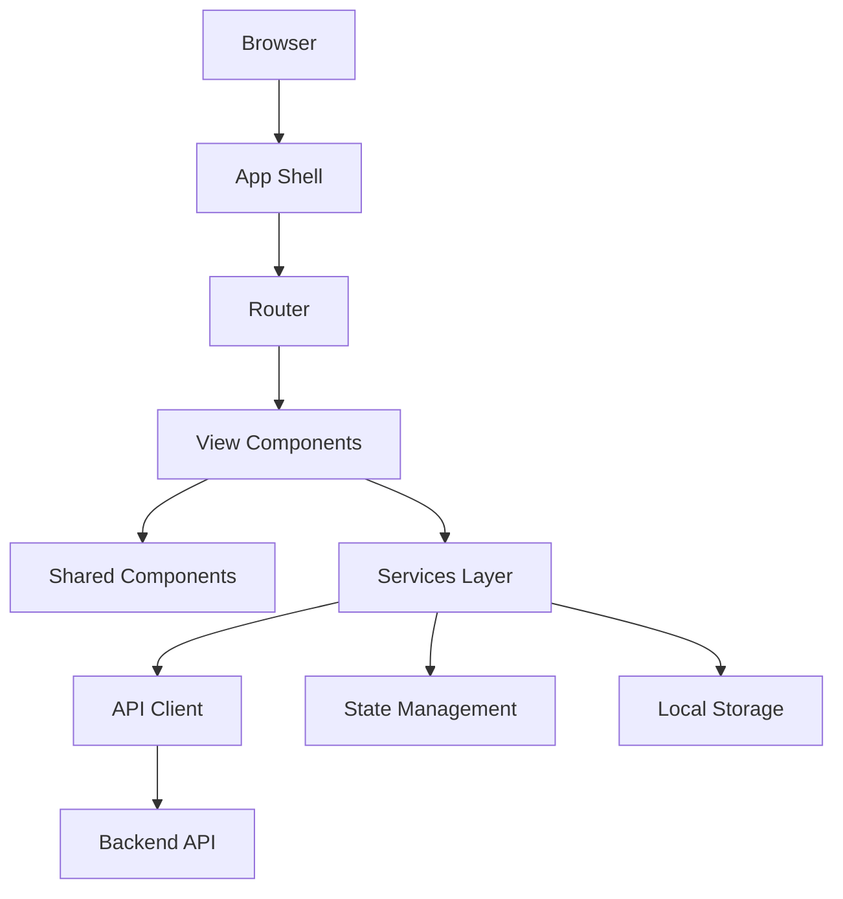

# Documento de Diseño - Aplicación de Gestión Escolar

## Visión General

La aplicación será una Single Page Application (SPA) moderna construida con tecnologías web de vanguardia. Utilizará una arquitectura basada en componentes con Catalyst como framework principal y Tailwind CSS para el diseño visual. La aplicación seguirá principios de diseño responsive y accesibilidad.

## Arquitectura

### Stack Tecnológico

- **Frontend Framework**: Catalyst (Lit-based web components)
- **CSS Framework**: Tailwind CSS
- **Build Tool**: Vite
- **Language**: TypeScript
- **State Management**: Lit reactive properties + Context API
- **Routing**: @lit-labs/router
- **Authentication**: JWT tokens con localStorage
- **API Communication**: Fetch API con interceptors
- **Testing**: Web Test Runner + Playwright

### Arquitectura de Alto Nivel



### Estructura de Directorios

```
src/
├── components/           # Componentes reutilizables
│   ├── ui/              # Componentes básicos de UI
│   ├── forms/           # Componentes de formularios
│   └── layout/          # Componentes de layout
├── views/               # Vistas principales
│   ├── news/
│   ├── notices/
│   ├── calendar/
│   ├── settings/
│   ├── profile/
│   └── users/
├── services/            # Servicios y lógica de negocio
│   ├── api/
│   ├── auth/
│   └── storage/
├── types/               # Definiciones de TypeScript
├── utils/               # Utilidades
├── styles/              # Estilos globales y Tailwind
└── assets/              # Recursos estáticos
```

## Componentes e Interfaces

### Componente Principal (App Shell)

```typescript
@customElement('school-app')
export class SchoolApp extends LitElement {
  @state() private currentUser: User | null = null;
  @state() private currentView: string = 'news';
  @state() private theme: Theme = 'system';
  @state() private language: string = 'es';
}
```

### Sistema de Navegación

```typescript
@customElement('app-navigation')
export class AppNavigation extends LitElement {
  @property() currentView: string = 'news';
  @property() userRole: UserRole = 'user';

  private navigationItems = [
    {
      id: 'news',
      icon: 'newspaper',
      label: 'Noticias',
      roles: ['user', 'admin'],
    },
    { id: 'notices', icon: 'bell', label: 'Avisos', roles: ['user', 'admin'] },
    {
      id: 'calendar',
      icon: 'calendar',
      label: 'Calendario',
      roles: ['user', 'admin'],
    },
    { id: 'users', icon: 'users', label: 'Usuarios', roles: ['admin'] },
  ];
}
```

### Componentes de Vista

#### Vista de Noticias

```typescript
@customElement('news-view')
export class NewsView extends LitElement {
  @state() private news: News[] = [];
  @state() private loading: boolean = false;

  async connectedCallback() {
    super.connectedCallback();
    await this.loadNews();
  }
}
```

#### Vista de Avisos

```typescript
@customElement('notices-view')
export class NoticesView extends LitElement {
  @state() private notices: Notice[] = [];
  @state() private unreadCount: number = 0;

  async markAsRead(noticeId: string) {
    await this.noticeService.markAsRead(noticeId);
    await this.loadNotices();
  }
}
```

#### Vista de Calendario

```typescript
@customElement('calendar-view')
export class CalendarView extends LitElement {
  @state() private events: CalendarEvent[] = [];
  @state() private selectedDate: Date = new Date();
  @state() private selectedEvent: CalendarEvent | null = null;
}
```

### Servicios

#### Servicio de Autenticación

```typescript
export class AuthService {
  private currentUser: User | null = null;

  async login(email: string, password: string): Promise<User> {
    const response = await this.apiClient.post('/auth/login', {
      email,
      password,
    });
    const { token, user } = response;
    localStorage.setItem('auth_token', token);
    this.currentUser = user;
    return user;
  }

  async logout(): Promise<void> {
    localStorage.removeItem('auth_token');
    this.currentUser = null;
  }

  isAuthenticated(): boolean {
    return !!localStorage.getItem('auth_token');
  }

  hasRole(role: UserRole): boolean {
    return (
      this.currentUser?.role === role || this.currentUser?.role === 'admin'
    );
  }
}
```

#### Servicio de API

```typescript
export class ApiClient {
  private baseURL = '/api';

  private async request<T>(
    endpoint: string,
    options: RequestInit = {}
  ): Promise<T> {
    const token = localStorage.getItem('auth_token');
    const headers = {
      'Content-Type': 'application/json',
      ...(token && { Authorization: `Bearer ${token}` }),
      ...options.headers,
    };

    const response = await fetch(`${this.baseURL}${endpoint}`, {
      ...options,
      headers,
    });

    if (!response.ok) {
      throw new Error(`API Error: ${response.status}`);
    }

    return response.json();
  }
}
```

## Modelos de Datos

### Interfaces TypeScript

```typescript
export interface User {
  id: string;
  firstName: string;
  lastName: string;
  email: string;
  role: UserRole;
  createdAt: Date;
  updatedAt: Date;
}

export interface News {
  id: string;
  title: string;
  content: string;
  summary: string;
  author: User;
  createdAt: Date;
  updatedAt: Date;
}

export interface Notice {
  id: string;
  content: string;
  author: User;
  recipients: User[] | UserGroup[];
  isRead: boolean;
  readAt?: Date;
  createdAt: Date;
}

export interface CalendarEvent {
  id: string;
  title: string;
  description: string;
  date: Date;
  author: User;
  createdAt: Date;
}

export interface AppSettings {
  theme: Theme;
  language: string;
  currentCourse: string;
}

export type UserRole = 'user' | 'admin';
export type Theme = 'light' | 'dark' | 'system';
```

### Validación de Datos

```typescript
export class ValidationService {
  static validateEmail(email: string): boolean {
    const emailRegex = /^[^\s@]+@[^\s@]+\.[^\s@]+$/;
    return emailRegex.test(email);
  }

  static validatePassword(password: string): ValidationResult {
    const minLength = 8;
    const hasUpperCase = /[A-Z]/.test(password);
    const hasLowerCase = /[a-z]/.test(password);
    const hasNumbers = /\d/.test(password);

    return {
      isValid:
        password.length >= minLength &&
        hasUpperCase &&
        hasLowerCase &&
        hasNumbers,
      errors: [],
    };
  }
}
```

## Gestión de Estado

### Context API para Estado Global

```typescript
@customElement('app-context')
export class AppContext extends LitElement {
  @provide({ context: userContext })
  user: User | null = null;

  @provide({ context: settingsContext })
  settings: AppSettings = {
    theme: 'system',
    language: 'es',
    currentCourse: '2025-2026',
  };

  @provide({ context: notificationContext })
  notifications: Notification[] = [];
}
```

### Reactive Controllers

```typescript
export class AuthController implements ReactiveController {
  host: ReactiveControllerHost;

  constructor(host: ReactiveControllerHost) {
    this.host = host;
    host.addController(this);
  }

  hostConnected() {
    this.checkAuthStatus();
  }

  private async checkAuthStatus() {
    if (this.authService.isAuthenticated()) {
      try {
        await this.authService.validateToken();
        this.host.requestUpdate();
      } catch {
        this.authService.logout();
      }
    }
  }
}
```

## Diseño Visual y UX

### Sistema de Diseño con Tailwind

```css
/* Configuración personalizada de Tailwind */
module.exports = {
  theme: {
    extend: {
      colors: {
        primary: {
          50: '#eff6ff',
          500: '#3b82f6',
          900: '#1e3a8a',
        },
        secondary: {
          50: '#f8fafc',
          500: '#64748b',
          900: '#0f172a',
        }
      },
      fontFamily: {
        sans: ['Inter', 'system-ui', 'sans-serif'],
      }
    }
  }
}
```

### Componentes de UI Reutilizables

```typescript
@customElement('ui-button')
export class UIButton extends LitElement {
  @property() variant: 'primary' | 'secondary' | 'danger' = 'primary';
  @property() size: 'sm' | 'md' | 'lg' = 'md';
  @property({ type: Boolean }) disabled = false;
  @property({ type: Boolean }) loading = false;
}

@customElement('ui-card')
export class UICard extends LitElement {
  @property() title?: string;
  @property({ type: Boolean }) elevated = false;
}
```

### Responsive Design

- **Mobile First**: Diseño optimizado para móviles como base
- **Breakpoints**: sm (640px), md (768px), lg (1024px), xl (1280px)
- **Navigation**: Hamburger menu en móvil, sidebar en desktop
- **Grid System**: CSS Grid y Flexbox para layouts adaptativos

## Gestión de Errores

### Error Boundary

```typescript
@customElement('error-boundary')
export class ErrorBoundary extends LitElement {
  @state() private hasError = false;
  @state() private error: Error | null = null;

  connectedCallback() {
    super.connectedCallback();
    window.addEventListener('unhandledrejection', this.handleError);
  }

  private handleError = (event: PromiseRejectionEvent) => {
    this.hasError = true;
    this.error = new Error(event.reason);
  };
}
```

### Manejo de Errores de API

```typescript
export class ErrorHandler {
  static handle(error: Error): void {
    console.error('Application Error:', error);

    if (error.message.includes('401')) {
      // Redirect to login
      window.location.href = '/login';
    } else if (error.message.includes('403')) {
      // Show permission denied message
      this.showNotification('No tienes permisos para esta acción', 'error');
    } else {
      // Show generic error
      this.showNotification('Ha ocurrido un error inesperado', 'error');
    }
  }
}
```

## Estrategia de Testing

### Testing de Componentes

```typescript
// Ejemplo de test para NewsView
describe('NewsView', () => {
  let element: NewsView;

  beforeEach(async () => {
    element = await fixture<NewsView>(html`<news-view></news-view>`);
  });

  it('should render news list', async () => {
    const newsList = element.shadowRoot?.querySelector('.news-list');
    expect(newsList).to.exist;
  });

  it('should load news on connect', async () => {
    const spy = sinon.spy(element, 'loadNews');
    element.connectedCallback();
    expect(spy).to.have.been.called;
  });
});
```

### Testing E2E

```typescript
// Ejemplo de test E2E con Playwright
test('user can view and create notices', async ({ page }) => {
  await page.goto('/login');
  await page.fill('[data-testid="email"]', 'user@test.com');
  await page.fill('[data-testid="password"]', 'password123');
  await page.click('[data-testid="login-button"]');

  await page.click('[data-testid="notices-nav"]');
  await expect(page.locator('.notices-list')).toBeVisible();

  await page.click('[data-testid="create-notice"]');
  await page.fill('[data-testid="notice-content"]', 'Test notice');
  await page.click('[data-testid="submit-notice"]');

  await expect(page.locator('text=Test notice')).toBeVisible();
});
```

### Testing de Servicios

```typescript
describe('AuthService', () => {
  let authService: AuthService;

  beforeEach(() => {
    authService = new AuthService();
  });

  it('should authenticate user with valid credentials', async () => {
    const mockUser = { id: '1', email: 'test@test.com', role: 'user' };
    sinon.stub(authService, 'login').resolves(mockUser);

    const user = await authService.login('test@test.com', 'password');
    expect(user).to.deep.equal(mockUser);
  });
});
```

## Seguridad

### Autenticación JWT

- Tokens almacenados en localStorage con expiración
- Refresh tokens para renovación automática
- Interceptors para agregar tokens a requests automáticamente

### Autorización Basada en Roles

```typescript
export class PermissionGuard {
  static canAccess(requiredRole: UserRole, userRole: UserRole): boolean {
    const roleHierarchy = { user: 1, admin: 2 };
    return roleHierarchy[userRole] >= roleHierarchy[requiredRole];
  }
}
```

### Validación de Entrada

- Sanitización de datos en formularios
- Validación tanto en cliente como servidor
- Protección contra XSS y injection attacks

## Performance

### Optimizaciones

- **Lazy Loading**: Carga diferida de vistas no críticas
- **Code Splitting**: División del bundle por rutas
- **Caching**: Cache de API responses y assets estáticos
- **Virtual Scrolling**: Para listas largas de datos
- **Image Optimization**: Compresión y formatos modernos

### Métricas de Performance

- First Contentful Paint < 1.5s
- Largest Contentful Paint < 2.5s
- Cumulative Layout Shift < 0.1
- First Input Delay < 100ms
